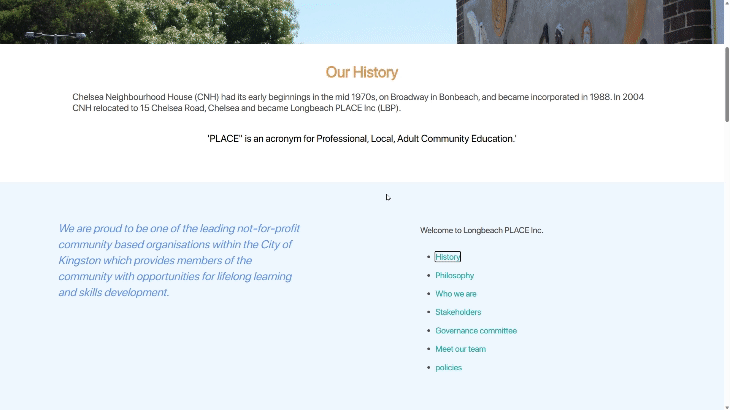

# COMP30022 IT Project - Team006 LongBeachPlace Website Product Report

--------------

## Table of Contents

- [Executive Summary](#executive-summary)
- [Introduction](#introduction)
- [Website Developing Work Progress](#website-developing-work-progress)
  - [Planning and Analysis](#planning-and-analysis)
  - [Development](#development)
  - [Testing](#testing)
  - [Deployment](#deployment)
- [Design and User Experience](#design-and-user-experience)
  - [User Interface Design](#user-interface-design)
  - [Accessibility and Responsiveness](#accessibility-and-responsiveness)
- [Features and Functionality](#features-and-functionality)
  - [Core Features](#core-features)
  - [Additional Features](#additional-features)
- [Challenges and Solutions](#challenges-and-solutions)
- [Project Management and Collaboration](#project-management-and-collaboration)
  - [Team Structure](#team-structure)
  - [Communication](#communication)
  - [Version Control](#version-control)
- [User Documentation and Support](#user-documentation-and-support)
- [Conclusion and Future Work](#conclusion-and-future-work)

----------------

## Executive Summary

As a part of the COMP30022 IT Project, our team, Team006, started on the journey of developing the LongBeachPlace website. Our mission was simple yet ambitious: to create a platform that was not only visually appealing and user-friendly but also robust and adaptive to different user needs.

From the outset, our objectives were clear. We aimed to build a website that would serve as a central hub for LongBeachPlace, facilitating a seamless user experience while providing comprehensive functionality for content management. To achieve this, we leveraged modern web technologies and embraced an Agile approach that allowed for flexibility and responsiveness to feedback throughout the development process.

The development was not without its hurdles. We encountered challenges, particularly in integrating a responsive design that would cater to both desktop and mobile users. The issue of creating an intuitive content management system also posed significant complexity. However, through a combination of team brainstorming sessions and consultation with our project mentors, we formulated solutions that not only resolved these issues but also enhanced the overall product.

The fruit of our labor is a website that stands out for its ease of navigation, aesthetic clarity, and responsive design. Its features, such as the dynamic content slider and the event management system, were developed with the end-user in mind, ensuring that visitors could access and interact with the site with minimal effort and maximum satisfaction.

As we look to the future, we are excited about the roadmap we've laid out for LongBeachPlace. Our plans include rolling out a user feedback system and integrating e-commerce functionalities, which we believe will further enrich the user experience and the client's business operations.

In wrapping up this project, we've not only delivered a product that we're proud of but also gained invaluable experience in teamwork, problem-solving, and technical development. This project is a testament to our team's commitment and hard work, and we are confident that it will fulfill, if not surpass, the expectations of both our client and the end-users.

------------

## Introduction

Our project's inception began with a clear mandate from Longbeach Place: to create a simple yet welcoming website that would attract a broad demographic, with a focus on middle-aged to younger users. The primary purpose was to present a general introduction to the company and its offerings in an engaging and modern interface.

Central to our development efforts was the client's vision for a website that was not just functional but also user-friendly and accessible. The desired outcome was a platform that felt fresh and modern, with particular attention to aesthetics and user experience. To this end, we were tasked with creating a comprehensive course booking system, a calendar for events, and a membership area complete with registration, login, and logout functionalities.

Our responsibilities extended to backend features critical for the organization's operations, such as an information storage system, a notification setup to alert users, and a check-in system for tracking attendance, possibly through QR codes. Additionally, the website needed to facilitate updates to user info and status, including links to social media and email.

The client's requirement for a crisp, modern-looking design was paired with specific functionalities like text-to-audio accessibility features, content pages, and integrated payment systems for room hires and donations. We were also encouraged to explore innovative features like reminder messages for waitlists and cancellations, potentially extending to an app to showcase Longbeach Place to a wider audience.

In this report, we delve into how our team interpreted these initial requirements, the subsequent updates we received, and how we translated them into a cohesive website that aligns with the client's objectives and user needs.

-------

## Website Developing Work Progress

### Planning and Analysis

At the inception of the Longbeach Place website project, our team, Team006, committed to a rigorous planning and analysis phase. This foundational step was crucial to align our development trajectory with the client's expectations and the users' needs

**Planning stage**

Our planning began with a kickoff meeting where we detailed the client's vision and established a project timeline. By reviewing initial requirement provide by client and the first zoom meeting, we form a robust understanding of the required features, design aesthetics, and functional components. Recognizing the client's emphasis on a modern and accessible platform, we outlined a technology stack that would facilitate a responsive and adaptive website.

The content page's UML has been added to the GitHub repository under the folder diagram. ([Uml.pdf](Diagram/Uml.pdf)) 

The use case has been added to the GitHub repository under the folder diagram ([use case diagram.pdf](Diagram/use%20case%20diagram.pdf))

**Client Requirements:**

- **Website Purpose:**
  - Create a simple, welcoming website to attract a diverse audience, focusing on middle-aged to younger demographics.
  - Provide a general introduction to Longbeach Place, its mission, and services.
- **User Experience:**
  - Develop a functional and user-friendly interface.
  - Ensure the website is fresh, modern, and accessible, with text-to-audio features for enhanced accessibility.
- **Design Aesthetics:**
  - Maintain a consistent layout throughout the website.
  - Use preferred color schemes, specifically avoiding bright orange and incorporating darker colors and pink.
  - Implement a dynamic content slider and event management system.
  - Redesign elements like the 'Contact Us' section with a blue background.
- **Functional Requirements:**
  - Back-end information storage system.
  - Notification system for updates.
  - Attendance check system with QR code capabilities.
  - User information update functionalities, including social media and email links.
  - A course booking system integrated with a calendar.
  - A membership area for registration and login/logout processes.
  - Payment gateway for room hires and donations.
  - Admin functionalities to update text, layout, images, etc.
- **Specific Features:**
  - Sponsors section to be labeled as "Supported By" with smaller logos.
  - Contact information, including phone, email, and social media links, should be clearly visible.
  - Subscription option for newsletters.
  - Reminder messages for waitlists, cancellations, etc.
  - Explore the potential for a mobile application.
- **Technical and Backend:**
  - A simple admin type without the need for multiple levels.
  - Database setup to accommodate the aforementioned features.
- **Miscellaneous:**
  - Responsive design for mobile and desktop.
  - Members and staff/tutor login portal with customized colors.
  - Admin login at the very bottom of the page.

| Category                    | Requirements                                                 |
| --------------------------- | ------------------------------------------------------------ |
| **Website Purpose**         | - Create a simple, welcoming website to attract a diverse audience. |
|                             | - Provide a general introduction to Longbeach Place, its mission, and services. |
| **User Experience**         | - Develop a functional and user-friendly interface.          |
|                             | - Ensure the website is fresh, modern, and accessible, with easier function to maintain the website. |
| **Design Aesthetics**       | - Maintain a consistent layout.                              |
|                             | - Use preferred color schemes, avoiding bright orange and incorporating darker colors and pink. |
|                             | - Implement a dynamic content slider and event management system. |
|                             | - Redesign the 'Contact Us' section with a blue background.  |
| **Functional Requirements** | - Back-end information storage system.                       |
|                             | - Notification system for updates.                           |
|                             | - Attendance check system with QR code capabilities.         |
|                             | - User information update functionalities, with social media and email links. |
|                             | - A course booking system integrated with a calendar.        |
|                             | - A membership area for registration and login/logout processes. |
|                             | - Payment gateway for room hires and donations.              |
|                             | - Admin functionalities to update text, layout, images, etc. |
| **Specific Features**       | - Sponsors section labeled as "Supported By" with smaller logos. |
|                             | - Visible contact information, including phone, email, and social media links. |
|                             | - Subscription option for newsletters.                       |
|                             | - Reminder messages for waitlists, cancellations, etc.       |
|                             | - Explore the potential for a mobile application.            |
| **Technical and Backend**   | - A simple admin type without the need for multiple levels.  |
|                             | - Database setup to accommodate the features listed.         |
| **Miscellaneous**           | - Responsive design for mobile and desktop.                  |
|                             | - Members and staff/tutor login portal with customized colors. |
|                             | - Admin login at the very bottom of the page.                |

As the page content group, our focus was primarily on ensuring that the content management aspect of the website was intuitive and efficient, allowing for easy updates and maintenance. This involved designing a user-friendly backend system that could handle dynamic content changes, such as new course offerings or event updates, without requiring technical expertise from the Longbeach Place staff. Below is an image example of what client want the frontend design to contains and look:-


We decided that the content page should contain the following elements:

Home Page -> Including Nav bar that can directly link to other section -> Drop down menu on Nav bar that link to a subsection of sections

- Login portal to the login page to let the user access user/ admin's dashboard
- Search function to search keywords on website (similar to ctrl+f) 

- Main content, including news and activities and incoming events, will be displayed in picture mode. The user will be able to click the picture and link to that specific page
- Under main content, there will be a section showing "Sponsor," where it shows who is currently supporting LongBeach Place and nav link to their home page 
- The contact us section will include a subscribing newsletter button, social media link

The Nav bar contains :

- About Us 

- Activities

- Contact

- Events

- GetInvolved

- Home

- Login

- RoomHire

- Showcase

  

**Development**

In the development phase of the Longbeach Place website, our primary focus was to materialize the client's vision into a functional and visually appealing digital platform. Key among these requirements was the design of the menu bar and the overall color scheme, which we approached with a combination of creative design and technical proficiency. The image below can serve as a reference point for the aesthetic and functional elements that our team design and need to incorporate into the Longbeach Place website.


**Menu Bar Design**

Understanding the crucial role of navigation in user experience, we invested significant effort in designing the menu bar. The client's call for simplicity and intuitiveness was at the forefront of our design process. We crafted a sleek and straightforward menu bar that complemented the website's overall aesthetic and facilitated ease of navigation. Structured to offer immediate access to all primary sections of the website, this menu bar ensures that users can locate their desired information effortlessly. The GIF below showcases the final version of the menu bar, featuring a built-in dropdown menu that allows users to navigate to their chosen section with a single click.


**Color Scheme Implementation**

The color scheme was a pivotal element in our development efforts, with the client expressing a strong preference for vibrant, beach-inspired colors such as sunny yellows and bright blues. To align with this vision of bringing the essence of the beach to the digital space, our design team undertook a thoughtful process of color selection. We aimed to capture the warmth and relaxation associated with Longbeach Place, resulting in a palette that was both inviting and reflective of the seaside setting.

In pursuit of the perfect beach-themed aesthetic, we developed five distinct color scheme versions. Each iteration was an exploration in hues and tones, drawing inspiration from the sun, sand, and sea. We paid particular attention to areas of the website for the background, we don't want the background to be full white(#FFF) as the bright white would hurt user's eye's when reading, therefore we select a softer white to remain the fresh look in the website but not too high contrast.


After presenting all versions to the client, we engaged in a collaborative selection process. The final choice was the second color scheme that best encapsulated the lively and refreshing ambiance of the beach, enhancing the website's visual appeal while meeting the client's specific requirements. This chosen palette now adorns the website, contributing to a consistent and thematic user experience that visitors can enjoy.

**Typography**

Our typography choices were similarly deliberate, aimed at ensuring readability across devices while complementing the overall design. We opted for clean, SF Display fonts that would be easy on the eyes and maintain legibility even on smaller screens.


**Editor function**

With the client's requirements for a dynamic and easily updatable website in mind, we turned our attention to the development of the edit function, a key feature that would empower the Longbeach Place team to maintain and refresh their content as needed. For this critical component, we chose Grape.js, an open-source web builder framework that's known for its flexibility and user-friendliness.

[^figure 1]: example of grape.js UI

Grape.js presented us with the tools necessary to build a custom editing interface from the ground up. The framework's drag-and-drop functionality allowed us to design a system where the user can intuitively manipulate page elements without any knowledge of coding. This interface includes a variety of features:

- **Customizable Layouts**: Users can easily adjust the layout to accommodate new content, ensuring the site remains visually engaging and informationally current.
- **Style Manager**: Grape.js's style manager was utilized to give users the ability to change styling properties, like fonts and colors, aligning with the website's beach-inspired theme.
- **Asset Manager**: Implementing an asset manager made managing images and other media straightforward, streamlining the process of updating visual content.
- **Responsive Design Preview**: We integrated a feature that allows the client to preview their changes in real-time across different device sizes, ensuring the website's responsiveness.
- **Content Blocks**: Predefined blocks of content can be dragged onto the canvas, making page updates and creation as simple as piecing together a puzzle.

During development, we iterated over several prototypes, refining the UI/UX until it met our standards for ease of use. We conducted user testing sessions with the Longbeach Place staff to gather feedback and further polish the editing experience. The final product is an edit function that is not only powerful and versatile but also approachable for users of all technical backgrounds.

The below gif is a short demo demonstrating how editor work


Furthermore, to streamline the content update process, we engineered a solution to convert our React JSX code into HTML for storage in the database. This translation allowed for the admin's content changes to be directly saved in a format that could be readily served to the website.

For instance, every time user did a change in the website, the database will immediate received an update


Upon completion of edits through the Grape.js interface, the updated content—now in HTML format—is committed to the database. This approach ensures that any modifications made by the admin are not only saved securely but are also immediately reflected in the backend.

.png)

[^figure 2]: uml diagram of editor function

The next step in the process involves retrieving the updated HTML from the database and rendering it back on the website. Our backend services, designed to work seamlessly with the React framework, fetch the revised content and update the website in real-time. This system provides a robust and efficient mechanism for content management, allowing for changes to be pushed live without any additional steps or technical intervention.

This methodology not only maintains the integrity and performance of the website but also affords the admin the flexibility to manage content dynamically. It embodies a seamless integration between the frontend and backend, culminating in a cohesive user experience both for the admin editors and the end-users visiting the Longbeach Place website.

In deploying Grape.js, we ensured that the Longbeach Place website remains a living entity, capable of evolving alongside the community it serves. The edit function stands as a testament to our dedication to providing a sustainable and self-sufficient digital solution.

**Contract form**

For the **Contact Form** on the Longbeach Place website, our development team implemented a modern, interactive form using React, harnessing the robust capabilities of various libraries and frameworks to deliver a seamless user experience.

- **Functional React Component with Hooks**

Leveraging the power of React's functional components and hooks, we crafted a dynamic contact form that responds to user input in real-time. The `useState` hook manages form state for fields such as the user's first name, last name, email address, phone number, and feedback. This approach ensures that the form is both responsive and performant.

- **Material-UI for User Interface**

To ensure a polished and consistent interface, we utilized Material-UI components. These pre-styled components allowed us to provide an accessible and aesthetically pleasing form without sacrificing functionality. Fields are intuitively laid out using the `Grid` system for a structured design, and the `Button` component is employed to submit the form, offering a clear call-to-action for the user.


- **Backend Communication and Security**

Using `axios`, the form asynchronously communicates with the backend server, located at a dynamic URL set by an environment variable. This allows for the flexible deployment of the backend across different environments without altering the frontend code. To safeguard against cross-site scripting (XSS) attacks, `DOMPurify` sanitizes user inputs before they are processed, ensuring that only secure content is submitted.

- **Email Integration**

The integration of `emailjs-com` facilitates direct email communication from the form. This library simplifies the process of sending emails, allowing us to configure an email service that dispatches user queries directly to Longbeach Place's administration. The result is a streamlined communication channel from the website to the client's inbox.

- **Styling and Responsiveness**

The contact form's styling is defined in a dedicated CSS file, ensuring that the form's presentation is both responsive and adaptable to various device sizes. Material-UI's `CssBaseline` component provides a consistent baseline to build upon, while responsive design practices ensure the form's usability across a wide range of devices.

- **User Experience Focus**

Our form's design prioritizes user experience, with clear labels and validation patterns that guide the user through the process of submitting their information. Real-time validation feedback informs users of any issues before submission, preventing errors and ensuring the quality of data received.


[^figure 3]: sample of invaild input notice


---------

## Testing

### User Stories:

- **New Visitor**: As a new visitor, I want to understand what LongBeach Place Inc. is, where is LongBeach Place Inc. and the events or activities LongBeach Place Inc. operates.
- **Potential Donor**: As a potential donor, I want to see the annual statement or report of LongBeach Place Inc. The success stories and data that demonstrate LongBeach Place Inc. are also desired.
- **Potential Volunteer**: As a potential volunteer, I want to quickly find out how I can get involved and contribute to the LongBeach Place Inc..
- **Current Member**: As a current member, I want to book or change my appointments and hire the room through an easy-to-use interface. Furthermore, I want to know what events are happening in LongBeach Place Inc..
- **Stakeholder**: As a stakeholder, I want to provide and view feedback about the LongBeach Place Inc.'s services and initiatives.
- **Partner**: As a partner, I want to access showcases, contact details and official statements easily.
- **User**: As a user, I expect the site to be accessible on mobile, tablet and desktop devices, with an intuitive and rationalised layout.

### Requirements:

- Home page with a clear navigation bar for easily access.
- An illustrative page contains LongBeach Place Inc.'s official information.
- Dynamic activities and events section with photos and quotes.
- A dedicated volunteer section with sign-up forms and information.
- A user-friendly appointment booking system.
- An accessible feedback form and display section.
- A contact page with organization details, media kits, and official statements.
- A responsive design that ensures usability across devices.

### Test Plan:

Based on the user stories and requirements defined above, three types of tests would be continuously conducted on the Website throughout the whole development process.

### 1. UI/UX Test

Given the context of the LongPlaceBeach Inc., ensuring the consistent and accurate presentation of information is paramount. The website would likely undergo several changes over time - updates to events details, activities information, and possibly design tweaks. Every change, even if minor, has the potential to unintentionally disrupt the UI/UX.

- **Objective**: Ensure that the website is intuitive, user-friendly, and aesthetically pleasing.

For UI/UX test, the Visual Regression Testing strategy will be adopted. It will ensures that changes to the user interface (whether expected or unintentional) are captured and reviewed. It makes sure the interface looks correct after code modifications.

Therefore, **BackstopJS** will be used as the tool for visual regression testing. The users can create a series of screenshots representing the "correct" appearance of your app or website. Then, every time you make changes, **BackstopJS** captures the screenshots again and compares them with the **reference screenshots**. This will detect the unexpected UI changes by highlighting visual discrepancies.

- During the development of the website, the visual regression testing will be conducted in every team member's **local development environment**, after they have make changes to the UI/UX of the website. The result will be demonstrated in the console output of the terminal and default browser.

#### UI/UX Testing process

1. Use **BackstopJS** to generate a set of **stable versions** of bitmaps as the reference.

   ```
   backstop reference
   ```

   

2. **After making changes to the UI/UX of the website**, check the comparison of reference and test screenshots generated by **BackstopJS** and ensure the modification is suitable and accessible from various devices.

   ```
   npm run test:backstop
   ```

   

   - The comparision will be conducted through multiple devices, ensure the responsive design: [](https://github.com/LangzeL/GD/blob/main/Testing Plan/UIUX Test/4.png) [](https://github.com/LangzeL/GD/blob/main/Testing Plan/UIUX Test/5.png) [](https://github.com/LangzeL/GD/blob/main/Testing Plan/UIUX Test/6.png) [](https://github.com/LangzeL/GD/blob/main/Testing Plan/UIUX Test/7.png)
   - The discrepancies will be highlighted: [](https://github.com/LangzeL/GD/blob/main/Testing Plan/UIUX Test/8.png) [](https://github.com/LangzeL/GD/blob/main/Testing Plan/UIUX Test/9.png) [](https://github.com/LangzeL/GD/blob/main/Testing Plan/UIUX Test/10.png) [](https://github.com/LangzeL/GD/blob/main/Testing Plan/UIUX Test/11.png)

3. **After checking the report**, if teams accept the modifications to the UI/UX of the website, the **BackstopJS** will be used to generate a new set of bitmaps as the new reference to update the reference data in the Backstop. This is for the next iteration of UI/UX testing; step one can be skipped for the next time's UI/UX testing.

4. Check the comparison of reference and test screenshots again, ensure the modifications have been deployed successfully and check the accessibility of the website.

   - All the comparisons will be passed, and there will be no errors. [](https://github.com/LangzeL/GD/blob/main/Testing Plan/UIUX Test/1.png) [](https://github.com/LangzeL/GD/blob/main/Testing Plan/UIUX Test/2.png) [](https://github.com/LangzeL/GD/blob/main/Testing Plan/UIUX Test/3.png)

### 2. Performance Test

Within the backdrop of the LongPlaceBeach Inc. website, prompt and efficient access to vital information, such as event dates, volunteering sign-ups, and donation methods, is crucial. As LongPlaceBeach Inc. grows and the site garners more traffic, slowdown or inefficiency could hinder the user experience, potentially leading to lost valuable opportunities.

- **Objective**: Ensure the website loads quickly, handles multiple users and remains stable under stress.

Performance testing ensures the website remains agile and efficient, even during peak traffic. Simulating various user loads and testing different aspects of the website's performance will ensure that every visitor, such as potential donors, volunteers, members, etc., has a seamless and optimal browsing experience.

**Lighthouse** will be adopted for the LongPlaceBeach Inc. website's performance Test tool. It can provide comprehensive insights into how the website performs, looking at metrics crucial for user experience like site load time, interactivity, and content stability as it loads. Beyond that, the actionable feedback on improving performance makes it outstanding from other tools.

#### Performance Testing process

1. The performance testing integrates within a **CI/CD framework**. After pushing the modifications to the git repository, every content update, design tweak, or feature addition is reviewed and passes automated tests.

```
  performance-testing:
    needs: [deploy-backend, deploy-frontend]
    runs-on: ubuntu-latest

    steps:
    - name: Install lighthouse
      run: npm install -g lighthouse
    
    - name: Create Lighthouse output directory
      run: mkdir -p performance_testing

    # Run lighthouse test
    - name: Run Lighthouse Performance Test
      run: lighthouse "https://longbeachfrontend-0adcfe405469.herokuapp.com/" --chrome-flags="--headless" --output=json --output-path=./performance_testing/testing-report.json
    
    - name: Upload Lighthouse Report
      uses: actions/upload-artifact@v2
      with:
        name: performance-testing-report
        path: ./performance_testing/testing-report.json
```


[](https://github.com/LangzeL/GD/blob/main/Testing Plan/performance-testing/1.png) [](https://github.com/LangzeL/GD/blob/main/Testing Plan/performance-testing/2.png)

1. After the testing, the report will be uploaded to the **Artifacts**. It will be downloaded and reviewed to ensure the website's compatibility and functionality.

[](https://github.com/LangzeL/GD/blob/main/Testing Plan/performance-testing/3.png)

- Performance testing report

```
{
"lighthouseVersion": "11.2.0",
"requestedUrl": "https://longbeachfrontend-0adcfe405469.herokuapp.com/",
"mainDocumentUrl": "https://longbeachfrontend-0adcfe405469.herokuapp.com/",
"finalDisplayedUrl": "https://longbeachfrontend-0adcfe405469.herokuapp.com/",
"finalUrl": "https://longbeachfrontend-0adcfe405469.herokuapp.com/",
"fetchTime": "2023-10-19T16:33:31.885Z",
"gatherMode": "navigation",
"runWarnings": [],
"userAgent": "Mozilla/5.0 (X11; Linux x86_64) AppleWebKit/537.36 (KHTML, like Gecko) HeadlessChrome/118.0.5993.70 Safari/537.36",
"environment": {
   "networkUserAgent": "Mozilla/5.0 (Linux; Android 11; moto g power (2022)) AppleWebKit/537.36 (KHTML, like Gecko) Chrome/109.0.0.0 Mobile Safari/537.36",
   "hostUserAgent": "Mozilla/5.0 (X11; Linux x86_64) AppleWebKit/537.36 (KHTML, like Gecko) HeadlessChrome/118.0.5993.70 Safari/537.36",
   "benchmarkIndex": 1304.5,
   "credits": {
      "axe-core": "4.8.2"
   }
},
"audits": {
   "is-on-https": {
      "id": "is-on-https",
      "title": "Uses HTTPS",
      "description": "All sites should be protected with HTTPS, even ones that don't handle sensitive data. This includes avoiding [mixed content](https://developers.google.com/web/fundamentals/security/prevent-mixed-content/what-is-mixed-content), where some resources are loaded over HTTP despite the initial request being served over HTTPS. HTTPS prevents intruders from tampering with or passively listening in on the communications between your app and your users, and is a prerequisite for HTTP/2 and many new web platform APIs. [Learn more about HTTPS](https://developer.chrome.com/docs/lighthouse/pwa/is-on-https/).",
      "score": 1,
      "scoreDisplayMode": "binary",
      "details": {
      "type": "table",
      "headings": [],
      "items": []
      }
   },
   "viewport": {
      "id": "viewport",
      "title": "Has a `<meta name=\"viewport\">` tag with `width` or `initial-scale`",
      "description": "A `<meta name=\"viewport\">` not only optimizes your app for mobile screen sizes, but also prevents [a 300 millisecond delay to user input](https://developer.chrome.com/blog/300ms-tap-delay-gone-away/). [Learn more about using the viewport meta tag](https://developer.chrome.com/docs/lighthouse/pwa/viewport/).",
      "score": 1,
      "scoreDisplayMode": "metricSavings",
      "warnings": [],
      "metricSavings": {
      "INP": 0
      },
      "guidanceLevel": 3
   },
   "first-contentful-paint": {
      "id": "first-contentful-paint",
      "title": "First Contentful Paint",
      "description": "First Contentful Paint marks the time at which the first text or image is painted. [Learn more about the First Contentful Paint metric](https://developer.chrome.com/docs/lighthouse/performance/first-contentful-paint/).",
      "score": 0.95,
      "scoreDisplayMode": "numeric",
      "numericValue": 1527.738,
      "numericUnit": "millisecond",
      "displayValue": "1.5 s",
      "scoringOptions": {
      "p10": 1800,
      "median": 3000
      }

      // Other sections of report ...
```

### 3. Penetration Test

Due to the LongPlaceBeach Inc. website might be handling the sensitive data, such as from feedback forms to potential donation details. The sanctity and security of this data cannot be overemphasized. Users trust LongPlaceBeach Inc. with their information, and any security breach could tarnish LongPlaceBeach Inc.'s reputation and become an obstacle to future development.

- **Objective**: Ensure the website is secure from common vulnerabilities and threats.

Penetration testing can conduct regular security audits to identify potential threats. Mainly focus on testing probes the website and associated databases for vulnerabilities that malicious entities could exploit.

Hence, **OWASP ZAP** will be adopted as the tool for penetration Tests. It can provide detailed information on potential vulnerabilities and offers passive and active scanning capabilities to identify threats.

#### [Penetration Testing process](https://github.com/LangzeL/GD/edit/main/README.md#penetration-testing-process)

1. The penetration Testing integrates within a **CI/CD framework**. After pushing the modifications to the git repository, all updates, tweaks, and feature additions are reviewed and systematically tested.

```
  penetration-testing:
    needs: [deploy-backend, deploy-frontend]
    runs-on: ubuntu-latest

    steps:
      - name: Checkout
        uses: actions/checkout@v2

      - name: Run OWASP ZAP Scan
        uses: zaproxy/action-baseline@v0.9.0
        with:
          token: ${{ secrets.GH_PAT }}
          docker_name: 'ghcr.io/zaproxy/zaproxy:stable'
          target: 'https://longbeachfrontend-0adcfe405469.herokuapp.com/'
          artifact_name: penetration-testing-report
          rules_file_name: '.zap/rules.tsv'
          cmd_options: '-a'
```


[](https://github.com/LangzeL/GD/blob/main/Testing Plan/penetration-testing/1.png) [](https://github.com/LangzeL/GD/blob/main/Testing Plan/penetration-testing/2.png)

1. After the testing, the report will be uploaded to the **Artifacts**. It will be downloaded and reviewed to ensure the website's security and identify threats.

[](https://github.com/LangzeL/GD/blob/main/Testing Plan/performance-testing/3.png)

- Penetration testing report [](https://github.com/LangzeL/GD/blob/main/Testing Plan/penetration-testing/3.png) [](https://github.com/LangzeL/GD/blob/main/Testing Plan/penetration-testing/4.png) [](https://github.com/LangzeL/GD/blob/main/Testing Plan/penetration-testing/5.png)

### Documentation

- All tests should be documented with objectives, tools, methodologies, and results.
- The identified issues should be labelled, documented and prioritized for fixing.

------------

## Deployment

Update in 10th/Nov/2023, the overall LBP website  was not deploy by the membership group yet, therefore the deployment in this document will only focus for LBP content group, which is deploy by team006.

## deploy url:

## Front end:

## [LongBeach Place Inc (longbeachfrontend0adcfe405469.herokuapp.com)](https://longbeachfrontend-0adcfe405469.herokuapp.com/)

## [Back end: ](https://github.com/LangzeL/COMP30022-Content/tree/main#back-end-error-longbeachbackend-2c4b09f98b44herokuappcom--dw-about-the-error)

## [Error (longbeachbackend-2c4b09f98b44.herokuapp.com)](https://longbeachbackend-2c4b09f98b44.herokuapp.com/) // dw about the error

### Deployment Process

Our deployment approach for the Longbeach Place website was automated using GitHub Actions, a CI/CD platform that allowed us to streamline our release process and ensure consistent builds. The configuration file `.github/workflows/deploy.yml` defines the deployment workflow named "Deploy to Heroku."


**Automated Workflows**

Upon every push to the `main` branch, the workflow triggers two primary jobs: `deploy-backend` and `deploy-frontend`. These jobs run on an `ubuntu-latest` virtual environment, emphasizing our commitment to using cutting-edge and reliable deployment infrastructures.

**Backend Deployment**

The `deploy-backend` job encompasses several steps to deploy the backend of the website:

- Code is checked out from the repository.
- Node.js modules are cached to speed up the build process.
- Authentication with GitHub CLI using a personal access token ensures secure interactions with GitHub's API.
- The backend directory is compressed, excluding the `node_modules` folder to minimize the deployment package size.
- The latest release version is fetched, incremented, and used to tag the new release.
- A GitHub Release for the backend is created with the new version tag and the latest commit message as release notes.
- The backend is deployed to Heroku by pushing the code to the Heroku Git repository using a subtree split to isolate the backend directory.

**Frontend Deployment**

Following the successful backend deployment, the `deploy-frontend` job begins:

- The frontend directory undergoes similar steps for caching, compression, and uploading to the backend's GitHub Release.
- The frontend is then deployed to a separate Heroku app using a similar approach to the backend, ensuring each part of the application is independently scalable and maintainable.

**Performance and Penetration Testing**

Post-deployment, the workflow includes `performance-testing` and `penetration-testing` jobs:

- Performance testing is conducted using Lighthouse, which assesses the frontend for performance, accessibility, best practices, and SEO. The resulting report is saved as a JSON file.
- Penetration testing is performed using OWASP ZAP Scan, a security tool that checks for vulnerabilities in the deployed frontend, ensuring the application's security posture remains robust.

This automated deployment process not only reflects our team's efficiency but also underscores our proactive stance on performance and security. The use of GitHub Actions and Heroku in tandem showcases our strategy to leverage cloud-native solutions and DevOps best practices to achieve a seamless deployment pipeline.

**Version Control and Release Management**

A key aspect of our deployment process was the implementation of a versioning system that allowed us to track and maintain different states of the application over time. With every deployment, our GitHub Actions workflow automatically incremented the version number, assigning a unique tag to each release.


**Automated Version Tagging**

The workflow included a step to fetch the latest release version from the GitHub repository. Utilizing a script, we automatically determined the next version number by incrementing the patch version. In cases where the patch version reached a predefined maximum, we incremented the minor version, and similarly for the major version, ensuring adherence to semantic versioning principles.

**Release Notes and Documentation**

Each versioned release was documented with release notes, typically the latest commit message, providing context for the changes included in that deployment. This practice ensured that we had a clear and traceable history of all changes, features, and fixes that were introduced.


[^figure 4]: sample patch note

**Maintenance and Rollbacks**

The use of tags proved invaluable not only for forward progression but also for maintenance and potential rollbacks. Should any issues arise with a new release, we could quickly revert to a previous tagged version, minimizing downtime and impact on end-users. This approach to release management bolstered our deployment strategy, providing stability and reliability to the deployment lifecycle.

**Consistent Updates and Upgrades**

By automating our versioning and tagging process, we ensured that each deployment to Heroku was consistent and trackable. This system allowed for seamless updates and upgrades, facilitating easy maintenance and support for the Longbeach Place website.

------------------

## Design and User Experience

#### User Interface Design

Our approach to the user interface (UI) design of the Longbeach Place website was driven by the principle of 'form follows function.' We aimed to craft a UI that was not just visually attractive but also facilitated an intuitive user journey.

- **Aesthetic Coherence**: We carefully curated a visual language that represented the Longbeach brand — from color schemes inspired by the seaside to typography that spoke to a friendly and inviting community space.

  

- **Intuitive Layouts**: The layouts were designed to minimize cognitive load, making information readily accessible and navigable. We focused on creating a balance between visual elements and content, ensuring clarity and emphasis where needed.


[^figure 5]: sample of clean picture and info that let user more accessible to the website, hover effect when mouse is pointing


As course planning is one of the key focus for website, making it visually appealing and easy to access was our aim, we change the layout of course by sub dividing those into different sub section, and each course have it's own information including duration of the course, the price of the course, etc. User will be able to access to any course by simply clicking the `Book Now` button.

- **Interactive Elements**: Interactive components such as buttons, links, and forms were designed to provide immediate and satisfying feedback to users, enhancing engagement and the overall experience.


[^figure 6]: hover when mouse was pointing on the subsection


[^figure 7]: user can use the next Silde icon to change home page Silde


[^figure 8]: user can easily access the map function by scrolling and dragging

#### Accessibility and Responsiveness

In our design process, accessibility and responsiveness were not afterthoughts but integral aspects from the onset.

- **Accessibility Standards**: We rigorously adhered to WCAG guidelines to ensure that the website was usable by people with a wide range of disabilities. This included providing alternative text for images, ensuring sufficient contrast ratios, and enabling keyboard navigation throughout the site.

  

  [^figure 9]: Example of using Tab and arrows to access the website

  The website was designed to be fully navigable using a keyboard alone, providing a seamless experience for users who cannot use a mouse due to mobility or visual impairments. We ensured logical tab orders and visible focus styles for interactive elements.

- **Responsive Design**: With a mobile-first approach, our design ensured that the website's interface adapted fluidly across a variety of devices and screen sizes. We utilized media queries and flexible grid layouts to maintain usability and aesthetics from desktop to smartphone. For instance we change the website navigation bar to a mobile friendly burger menu which create easier and satisfier user experience when user is browsing our website:


And below is few more example showing our responsive design in moblie view:


Changing column to one makes the subsection looks more clean and provide consistent accessbility.

In conclusion, the UI design's strategic balance of aesthetics and functionality, paired with a staunch commitment to accessibility and responsive principles, resulted in a product that delivers a superior and inclusive user experience.

--------------

### Features and Functionality

#### Core Features

Our team has equipped the Longbeach Place website with a suite of features designed to enhance the user experience and simplify site administration.

#### Core Features

- **Content Management System (CMS)**: At the heart of the website, our CMS stands as a user-friendly platform that empowers administrators to manage and publish content. This includes an intuitive interface for handling text updates, image uploads, and multimedia content across various pages, ensuring that the website remains current and informative.


- **Overall Website Design**: The website's design was meticulously crafted to reflect Longbeach Place's brand identity. It emphasizes a clean, modern aesthetic that engages users while providing an organized structure for easy navigation.
- **Event Tracking Panel**: The event tracking panel provides a centralized dashboard for event management, linked to the event's group. It allows for efficient organization and display of upcoming events, encouraging community participation and interaction.(Update in 10th Nov 2023, Event groups haven't integrate their code into our page)


- **Course Booking Page**: We developed a dedicated course booking page, linked to the course booking group, that offers a streamlined process for users to browse, register, and manage their course enrollments with ease and convenience.


- **Contact Form**: A strategically placed contact form features robust validation and anti-spam measures, ensuring that users can communicate with Longbeach Place securely and effortlessly.

  

- **Responsive Navigation**: The navigation system is designed to be fully responsive, adapting to various screen sizes and devices, ensuring a consistent user experience whether accessed from a desktop, tablet, or smartphone.


- **User Authentication** (This feature was remove when integrating with membership's work, as we wants to avoid duplicate work): Secure user authentication processes enable distinct user roles, including members and staff, to access personalized areas of the website.


#### Additional Features

- **Gallery**: An image gallery feature showcases the vibrant community and activities at Longbeach Place, providing a visual narrative of the experiences they offer.

  

- **Room Hire Page**: This feature offers detailed information on room availability and the hiring process, facilitating easy reservations for community members.

  

- **Get Involved Page**: The 'Get Involved' page serves as a call-to-action for community engagement, providing visitors with information on volunteering, donations, and other forms of participation.

  

- **Interactive Map Function**: A crucial addition to the website is the interactive map function. This feature provides users with a visual representation of Longbeach Place's location and surroundings. It enables visitors to easily find directions, explore nearby landmarks, and access travel information with just a few clicks. The map is integrated with user-friendly controls and is designed to be responsive, ensuring it works seamlessly across all devices. This tool is particularly useful for new visitors planning their visit to Longbeach Place, enhancing their experience by simplifying access and navigation.

  

- **Subtle Animations**: To elevate the aesthetic appeal and interactivity of the Longbeach Place website, we incorporated subtle animations throughout the user interface. These animations are strategically placed to draw attention to key sections, like the interactive map and event listings, without being distracting or overwhelming. They serve to enhance the user's engagement with the website, providing a modern, dynamic user experience. Whether it's a button that changes color when hovered over, elements that slide in to reveal more content, or icons that animate to indicate loading processes, these small details contribute significantly to a polished and responsive interface.

  - What the client wants:

  

  - What we provided:

  

These features collectively create a robust digital ecosystem that not only meets the needs of Longbeach Place's administrators and users but also enriches the overall user experience. Our focus on both functionality and aesthetics ensures that each visit to the website is both engaging and productive.

--------------

## Challenges and Solutions

Throughout our journey in developing the Longbeach Place website, Team 006 faced a series of challenges that tested our resolve, ingenuity, and technical prowess. Here are some of the significant hurdles we encountered, along with the strategies we employed to overcome them.

**Challenge: Steep Learning Curve with React**

Our initial foray into using React posed a steep learning curve. With most team members lacking prior experience in website development, we were tasked with not only designing but also learning to implement our designs using React—a powerful yet complex JavaScript library.

**Solution: Collaborative Learning and Research**

We tackled this challenge head-on through collective learning and research. By supporting each other, sharing knowledge, and utilizing tutorials and resources, we rapidly upskilled ourselves in React. This collaborative approach allowed us to build a solid foundation in front-end development and fostered a team culture of continuous learning and problem-solving.

**Challenge: Designing a Modern and Functional Website**

The client's requirement for a modern, engaging, and functional website necessitated a design overhaul of the existing site. We were tasked with infusing new life into a dated and cluttered interface, all while adhering to the functionality and user-friendliness that the client emphasized.

**Solution: User-Centric Design Approach**

Our solution was a user-centric design approach that focused on decluttering the interface, choosing a vibrant yet harmonious color palette, and simplifying navigation. By introducing a user menu, search bar, and a more intuitive navbar, we enhanced the website's usability and aesthetic appeal.

**Challenge: Deployment Without Existing Infrastructure**

A significant challenge was the absence of any existing server or database infrastructure, combined with our team's limited experience in deployment practices.

**Solution: Learning Deployment Platforms and CI/CD Integration**

We addressed this by educating ourselves on deployment platforms, specifically Heroku, and integrating Continuous Integration and Continuous Deployment (CI/CD) pipelines. We also segmented the front end and back end into separate Heroku apps for better scalability and control, leading to a reliable deployment process.

**Challenge: Responsive Design Adaptation**

Initially, we had not fully considered the need for responsive design. The fixed frontend layout we created was not compatible with various device sizes, which could have led to a suboptimal user experience.

**Solution: CSS Adjustments and Mobile-First Layouts**

To resolve this, we revisited our CSS files and made adjustments to ensure high visuality and accessibility across all devices. We adopted a mobile-first approach, adjusting font sizes, transitioning horizontal structures to vertical, and implementing a hamburger menu for better content accessibility and navigation on smaller screens.

**Conclusion: Overcoming and Learning**

In overcoming these challenges, we learned more than just coding and technical skills. We developed documentation skills, an understanding of team collaboration, and a firsthand experience of what it takes to run an IT project in the real world. This project was not only about building a website but also about building our capabilities as future IT professionals.

-------------------

### Project Management and Collaboration

Effective project management and collaboration were crucial to the success of the Longbeach Place website project. Our approach was systematic and leveraged a combination of clear team structure, open communication channels, and robust version control practices.

#### Team Structure

Our team, Team 006, was strategically organized to maximize efficiency and leverage each member's strengths. Chris and the Long Beach Place team provided oversight and direction, ensuring our efforts were aligned with the project goals. As the product owner, Langze was the main conduit of communication between the client and our team, ensuring all client needs were met. Wenda Zhang, as the Technical Lead, was responsible for overseeing the architectural integrity of both the front-end and back-end. Jing Yun Tan brought our concepts to life as the UI/UX designer, while Shanqing Huang managed our codebase as the Project Manager. Finally, Yilin Chen, our Test Engineer, ensured that our code was robust and bug-free.

Below is an more specific role:

### Development Team

| Role                   | Primary Assignee | Secondary Assignee | Responsibilities                                           |
| ---------------------- | ---------------- | ------------------ | ---------------------------------------------------------- |
| Product Owner          | Langze Lu        |                    | Oversee the development process, liaison with stakeholders |
| Tech Lead              | Wenda Zhang      | Langze Lu          | Lead technical discussions and decisions                   |
| Front-end Dev Engineer | Langze Lu        | Wenda Zhang        | Manage specific features or sections of the website        |
| Back-end Dev Engineer  | Jing Yun Tan     | Yilin Chen         | Manage server-side logic and database interactions         |
| QA Engineer            | Yilin Chen       | Wenda Zhang        | Ensure the quality of the product through testing          |
| UI/UX Designer         | Jing Yun Tan     |                    | Design the user interface and user experience              |
| Architect              | Shanqing Huang   | Langze Lu          | Design the software architecture                           |
| Code Maintenance       | Shanqing Huang   | Yilin Chen         | Maintain code quality and manage technical debt            |
| Debug + Test           | Yilin Chen       | Wenda Zhang        | Identify and fix bugs, perform testing                     |

### Operation Team

| Role                                 | Assignee       | Responsibilities                                             |
| ------------------------------------ | -------------- | ------------------------------------------------------------ |
| Operations Manager                   | Langze Lu      | Oversee operational aspects and coordinate tasks             |
| System Administrator/DevOps Engineer | Wenda Zhang    | Manage system configuration and streamline deployment processes |
| Release Manager                      | Jing Yun Tan   | Manage software releases                                     |
| Database Administrator               | Yilin Chen     | Manage database configuration and operations                 |
| Security Analyst                     | Shanqing Huang | Ensure the security of the software                          |
| Monitoring Engineer                  | Wenda Zhang    | Monitor system performance and address issues                |

#### Communication

The effectiveness of our project hinged on clear and consistent communication:

- **Slack**: Used for overarching communication within the team to keep everyone informed and aligned.
- **WeChat**: Facilitated brainstorming and internal team discussions.
- **Zoom**: Enabled our weekly stand-ups and client meetings, maintaining regular progress check-ins.
- **Email**: Served as the formal communication channel with our client, ensuring a record of all official correspondence.
- **GitHub**: Acted as a centralized hub for not just our code but also for documentation and project artifacts, ensuring transparency and accessibility for all team members.

#### Version Control

Our version control system was central to our project management strategy. We used GitHub to manage our codebase, which was critical in handling the various code contributions from team members:

- **Branching Strategy**: We implemented a branching model that allowed for feature development, bug fixes, and experimentation without disrupting the main codebase.
- **Pull Requests and Code Reviews**: These were standard practice, ensuring code quality and consistency. They also facilitated knowledge sharing and collaborative problem-solving.
- **Release Tagging**: For each deployment, we used semantic versioning and tagging to document our progress and create a clear deployment history.

Through diligent project management and collaboration, we not only met our project objectives but also cultivated a team environment that encouraged learning, innovation, and mutual support. This foundation of structured management and teamwork was pivotal in navigating the complexities of the project and delivering a final product that we are proud of.

-------------------------

### User Documentation and Support

To ensure a smooth transition and continued ease of use, we've developed comprehensive user documentation and support resources for the Longbeach Place website. This documentation is designed to empower users with the knowledge to navigate, manage content, and utilize the site's features to their full potential.

- 


-----------------------------

### Conclusion and Future Work

As we reach the conclusion of the Longbeach Place website project, we reflect on a journey marked by innovation, collaboration, and growth. Our team has successfully delivered a website that not only meets but exceeds the client's expectations in terms of design, functionality, and user experience.

**Future Enhancements**:

- **Continuous Improvement**: We are committed to the continual enhancement of the website based on user feedback and emerging web technologies.
- **Scalability**: Plans are in place to ensure the website can scale with the growing needs of Longbeach Place, adding new features and functionalities as required.
- **Performance Monitoring**: We will implement more advanced analytics and performance monitoring tools to gain deeper insights and optimize the user experience continually.
- **Training and Workshops**: To further support the Longbeach Place team, we will offer training sessions and workshops that focus on advanced features and best content management practices.

**Looking Ahead**: The project, though complete, marks the beginning of a new chapter for Longbeach Place as they continue to serve their community through this digital platform. As for Team 006, the experience has been enriching and invaluable, setting a strong foundation for our future endeavors in technology and development.
